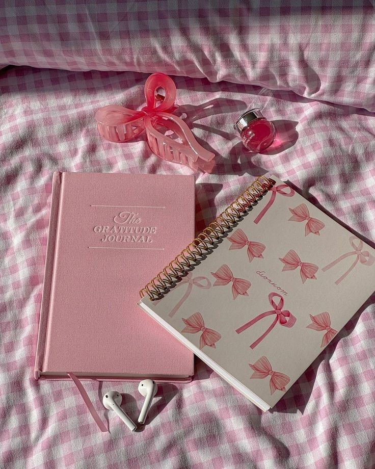

<!DOCTYPE html>
<html lang="fr">
<head>
    <meta charset="UTF-8">
    <meta name="viewport" content="width=device-width, initial-scale=1.0">
    <title>Inspire Studio</title>
    
</head>
<body>

    <header>
        <h1>Inspire Studio</h1>
        
Créations uniques, pensées avec amour et douceur.

    </header>

    
“✨ Ce sont des articles <strong>personnalisés</strong>, faits pour refléter votre style, votre histoire et votre émotion. ✨”

    
“🕊️ L’élégance, la simplicité et la touche personnelle — voilà ce qui rend chaque création inoubliable.”

    
“🌿 Offrez plus qu’un produit, offrez une émotion signée Inspire Studio.”

    <section class="container">
        

            
            

                <h3>des bags & paquets personnalisés </h3>
                
Personnalisez vos sacs, mettez votre style en avant.

                
20 DT

            

        

        

            
            

                <h3>Des boucles  Personnalisés</h3>
                
Élégance & personnalité, vos boucles qui racontent votre style.

                
10  DT

            

        

        

            
            

                <h3> Gift Boxes</h3>
                
Découvrez nos coffrets cadeaux prêts à offrir !

                
23 DT

            

        

        

            
            

                <h3>Journals personnalisés</h3>
                
Votre créativité, votre agenda, votre univers.

                
12 DT

            

        

    </section>

  NB : Des stickers uniques et personnalisés sont désormais disponibles 💖

    <footer>
        
📞Contactez-moi : <strong>+216 99 363 139 </strong>

        
📸 Suivez-nous sur Instagram : <a href="https://www.instagram.com/inspire_studio119?utm_source=ig_web_button_share_sheet&igsh=ZDNlZDc0MzIxNw==">@inspirestudio</a>

    </footer>

</body>
</html>
